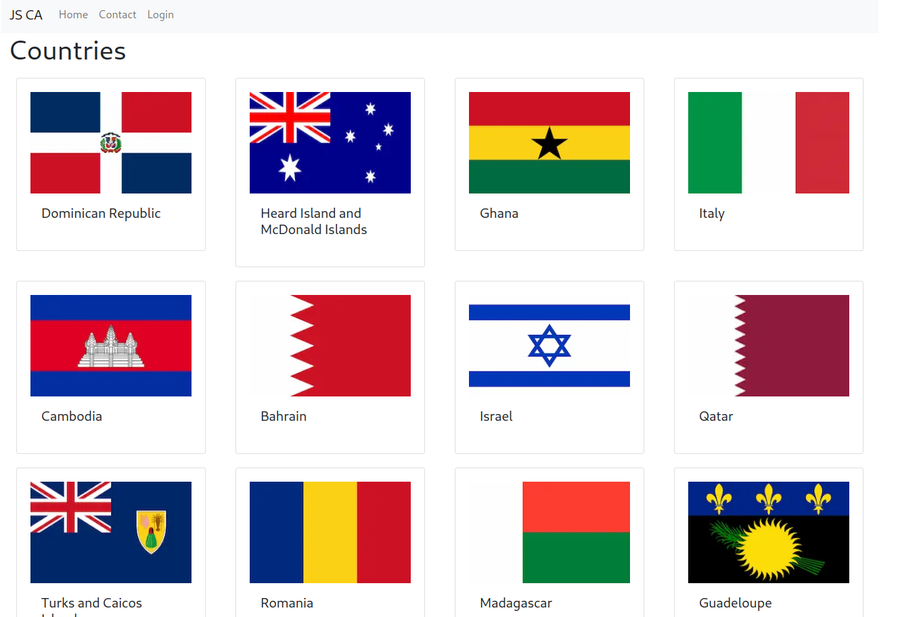

# Javascript Frameworks Course assignments



A simple project demonstrating Next.js

## Description

A project made with Next.js demostrating the use of:

- Next.js
- React Bootstrap
- Strapi and JWT
- Rest API
- Login

## Built With

- [Next.js](https://nextjs.org//)
- [React Bootstrap](https://react-bootstrap.github.io/)

## Getting Started

### Installing

1. Clone the repo:

```bash
git clone https://github.com/Noroff-FEU-Assignments/js-frameworks-course-assignment-kronosGR.git
```

2. Install the dependencies:

```
npm install
```

### Running

```bash
npm run dev
```

## Contact

Contact me through the following links.

[My LinkedIn page](https://www.linkedin.com/in/kronosgr/)
